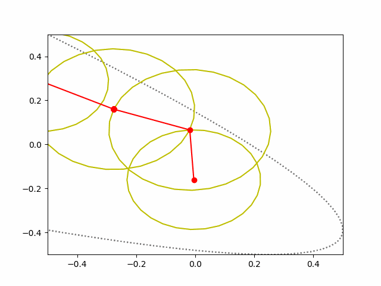

<table border="0" width="10%">
  <tr>
    <td></td>
    <td></td>
    <td></td>
  </tr>
  <tr>
    <td></td>
    <td></td>
    <td></td>
  </tr>
   <tr>
    <td></td>
    <td></td>
    <td></td>
  </tr>
</table>

## 用几个圆画任意图

[](https://pypi.org/project/fourier_artist/)
[](https://travis-ci.com/guofei9987/fourier_artist)
[](https://codecov.io/gh/guofei9987/fourier_artist)
[](https://github.com/guofei9987/fourier_artist/blob/master/LICENSE)


[](https://gitter.im/guofei9987/fourier_artist?utm_source=badge&utm_medium=badge&utm_campaign=pr-badge&utm_content=badge)


### 安装
```bash
pip install fourier_artist
```

### 示例：傅里叶变换画心
（随便画几个圈都是爱你的样子）

```python
# 导入包
import numpy as np
import matplotlib.pyplot as plt
from fourier_artist.clean_data import get_data_from_func, clean_data
from fourier_artist.draw import draw
from matplotlib.animation import FuncAnimation


# 导入数据，这个X你可以自己制定画什么图
X = get_data_from_func()
# 清洗数据
X = clean_data(X)
fig, ax = plt.subplots(1, 1)
update_all = draw(X, fig, ax)
ani = FuncAnimation(fig, update_all, blit=True, interval=25, frames=len(X))
# ani.save('fourier.gif', writer='pillow')
plt.show()
```


## draw everything you like
```python
import numpy as np
import matplotlib.pyplot as plt
from fourier_artist.clean_data import get_data_from_func, clean_data
from fourier_artist.draw import draw
from matplotlib.animation import FuncAnimation

# 导入数据
X = get_data_from_func()

n = 100
t = np.linspace(0, 2 * np.pi, n)
x = (np.sin(t)) ** 2
y = (np.cos(t)) ** 2 + np.cos(t)
X = x + 1j * y

# 清洗数据
X = clean_data(X)
fig, ax = plt.subplots(1, 1)
update_all = draw(X, fig, ax)
ani = FuncAnimation(fig, update_all, blit=True, interval=25, frames=len(X))
# ani.save('demo2.gif', writer='pillow')
plt.show()
```



